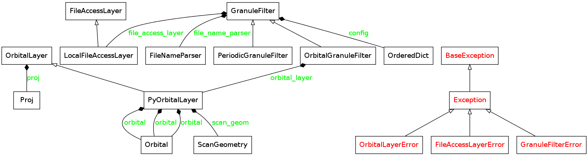
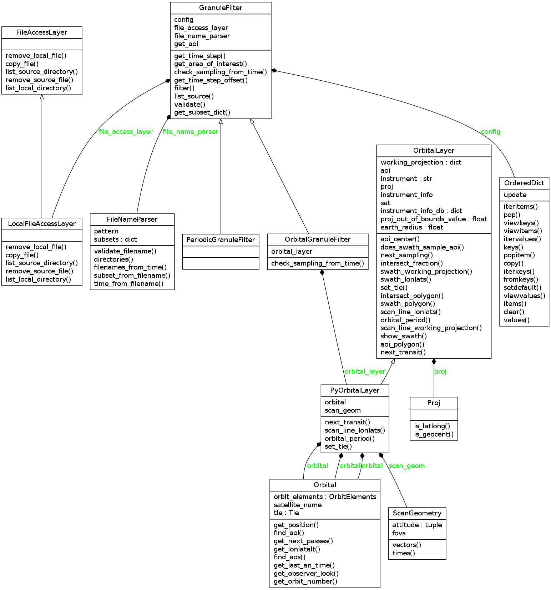

Architecture (DRAFT)
----------------------

The main high level module in pygranule is the GranuleFilter.
The GranuleFilter holds the granule acquisition configuration,
and aggregates more low level objects that assist it in 
evaluating satelltie granules.  Notably, a FileNameParser,
OrbitalLayer and a FileAccessLayer objects are aggregated
and operated by the filter.

architecture overview
^^^^^^^^^^^^^^^^^^^^^^^^^^

GranuleFilter in detail
^^^^^^^^^^^^^^^^^^^^^^^^^^^

