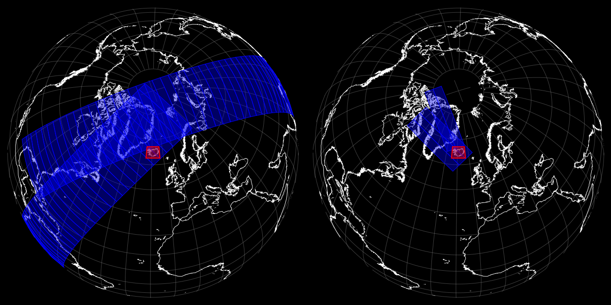
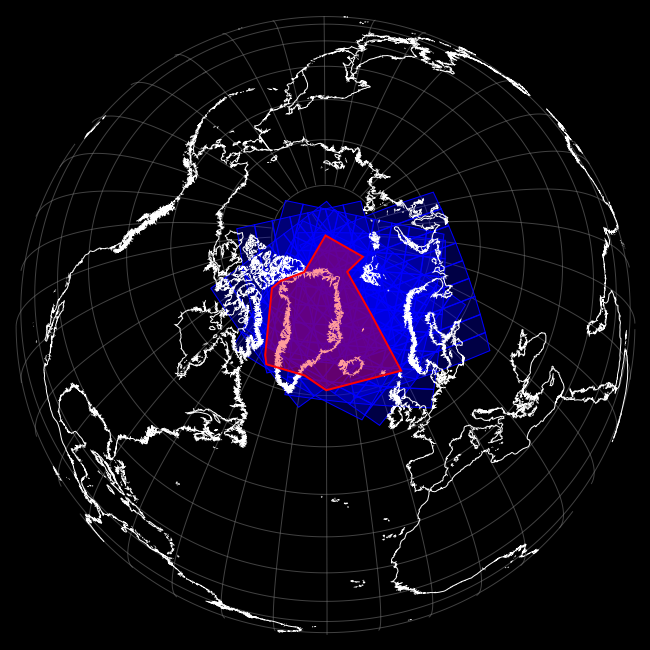
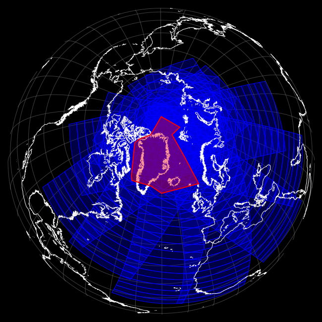
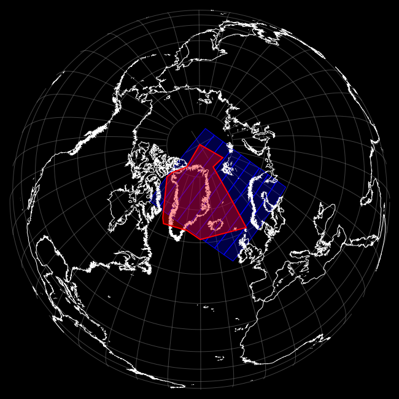
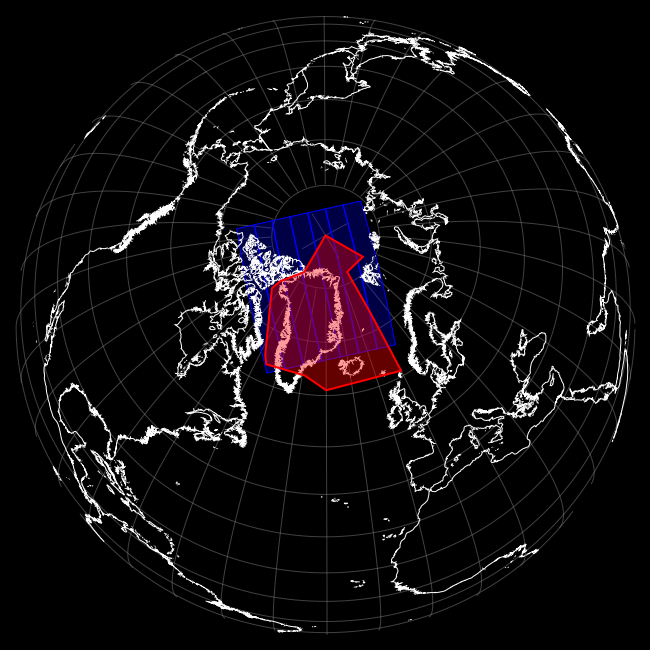

.. pygranule documentation master file, created by
   sphinx-quickstart on Wed Nov 27 13:05:45 2013.
   You can adapt this file completely to your liking, but it should at least
   contain the root `toctree` directive.

.. meta::
   :description: Python project adding logos, texts, and color scales to PIL images
   :keywords: Python, operational, meteorology, granules, scheduling

Welcome to pygranule's documentation!
======================================

pygranule is a package for validating, fetching and scheduling 
satellite data granules.
The source code of the package can be found on google code, googlecode_

The main purpose is to filter some satellite granule file names,

    >>> files = ['/home/msg/archive/AVHRR/avhrr_20140225_133000_noaa19.hrp.bz2', 
                 '/home/msg/archive/AVHRR/avhrr_20140225_133100_noaa19.hrp.bz2', 
		 '/home/msg/archive/AVHRR/avhrr_20140225_133200_noaa19.hrp.bz2',
		 ...,
		 '/home/msg/archive/AVHRR/avhrr_20140225_152900_noaa19.hrp.bz2']

Using a configuration to describe the file set,

    >>> config = {'config_name':"DummySatData",
                  'sat_name':"NOAA 19",
		  'instrument':"AVHRR",
                  'file_source_pattern':"/home/msg/archive/AVHRR/avhrr_%Y%m%d_%H%M00_noaa19.hrp.bz2",
                  'time_step':"00:01:00",
                  'time_step_offset':"00:00:00",
                  'area_of_interest':"(-25,62.5),(-25,67),(-13,67),(-13,62.5)"}
    >>> gf = OrbitalGranuleFilter(config)

We can now do some on the fly operations on the files,
e.g., show all the granules,

    >>> gf.show( files )

or filter the granules, allowing only those that match the configuration,
returns an iterable file paths container but with a handle back to the
parent filter, allowing handy attributes such as, :attr:`.show()`,

    >>> gf( files ).show()

Filters can also interact with local and remote file systems to access
granule file names,

    >>> config = {'config_name':"EARS NOAA 19 AVHRR",
                  'sat_name':"NOAA 19",
		  'instrument':"AVHRR",
		  'protocol':"sftp",
		  'server':"msg@msg01.vedur.is",
		  'file_source_pattern':"/home/msg/archive/AVHRR/avhrr_%Y%m%d_%H%M00_noaa19.hrp.bz2",
		  'time_step':"00:01:00",
		  'time_step_offset':"00:00:00",
		  'area_of_interest':"(0.0,73.0),(0.0,61.0),(-30.0,61.0),
	                              (-39,63.5),(-55.666,63.5),(-57.75,65),
				      (-76,76),(-75,78),(-60,82),(0,90),(30,82),(0,82)"}
    >>> F = OrbitalGranuleFilter(config)
    >>> F().show()

Now, if you wanted to turn off area of interest filtering
to show all the granules in the source file system,
then,

    >>> F(with_aoi=False).show()

Targeted granules can also be readily split into chunks (satellite passes),

    >>> for chunk in F().split():
    >>>     chunk.show()

...
Off course granule filter will be able to do much much more ...

.. _googlecode: http://code.google.com/p/pygranule/

Contents:

.. toctree::
   :maxdepth: 2

   installation
   usage
   examples
   programming

Indices and tables
==================

* :ref:`genindex`
* :ref:`modindex`
* :ref:`search`

