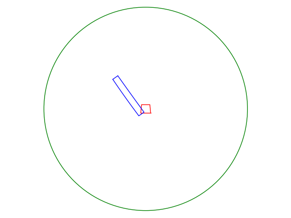
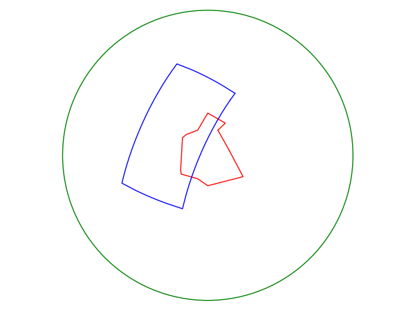

Usage (DRAFT)
-------------

The getsat package has been developed to help abstract
the acquisiton of satellite data granules.
Procedures for collecting satellite earth observation data 
for a particular target region (area of interest) is a necessary fist 
step an automated processing chain.

Satellite Earth observing systems and instruments are varied.
Many systems observe the earth continuously, either with
a fixed repetition, or based on continuous scans (swaths) as the 
satellite moves across the Earth.

Commonly such earth observation data is delivered in a segmented
way, separated into data granules that represent different time
periods of data recorded by the satellite instrument.
Furthermore, some instrument data is also segmented into data
channels, and data subsets (e.g. MODIS HDF-EOS and SEVIRI-HRIT data).

The little nuances in data granulation and subsetting
of different instruments can easily make acquisition code
inhomogeneous and cluttered.

Acquisition config files
^^^^^^^^^^^^^^^^^^^^^^^^^^

Simple configuration files are
created to describe the data acquisition.
The file specifies among other things the satellite,
instrument type, target area, filename pattern,
granulation and data subsetting.

From the config file getsat should be able
to evaluate if a particular incoming data
granule is part of the target data set.

TODO: Eventually user provided trigger functions will be
made available to perform actions on the data, including
moving/downloading the data sets to a data archive.

Periodic type acquisition:

.. code-block:: none

  [HRIT_SEVIRI_MSG-3]
  sat_name: MSG-3
  sat_id:
  instrument: SEVIRI
  type: periodic
  protocol: scp
  server: msg01.vedur.is
  file_source_pattern: /home/msg/archive/SEVIRI/HRIT/H-000-MSG3__-MSG3________-{0}___-00000{1}___-%Y%m%d%H%M
  time_step: 00:15:00
  time_step_offset: 00:00:00
  subsets: {IR_108:{1..8}, WV_073:{1,2,3,4,5,6,7,8}}

Orbital type acquisition:

.. code-block:: none

  [EARS_AVHRR_NOAA-19]
  sat_name: NOAA-19
  sat_id:
  instrument: AVHRR
  type: orbital
  protocol: scp
  server: msg01.vedur.is
  file_source_pattern: /home/msg/archive/AVHRR/avhrr_%Y%m%d_%H%M00_noaa19.hrp.bz2
  time_stamp_alignment: 0.0 #beginning
  time_step: 00:01:00
  time_step_offset: 00:00:00
  area_of_interest: (-25,62.5),(-25,67),(-13,67),(-13,62.5)

AcquisitionConfig objects
^^^^^^^^^^^^^^^^^^^^^^^^^^

First off, all acquisition config files should be placed
in the same folder, and the GETSAT_CONFIG_PATH environment variable
should point to this folder, e.g.,

.. code-block:: none

   $ export GETSAT_CONFIG_PATH=$HOME/etc/getsat/

loading the acquisition configs
++++++++++++++++++++++++++++++++

It should then suffice to import 
a function that loads acquisitions from the 
acquisition config files,

  >>> from getsat import get_acquisition_config

Every valid configuration will then be loaded as part of an
AcquisitionConfig object.  To get a list of all the configuration
objects, do

  >>> configs = get_acquisition_config()

The objects can be printed to show their settings,

  >>> for c in configs:
  >>>     print c

evaluate an incomming filename
+++++++++++++++++++++++++++++++

Incoming filenames can be evaluated against the configuration.
A successful match is a filename that matches in pattern but also in 
coverage, sampling the AOI.

  >>> incoming_filename="/home/msg/archive/AVHRR/avhrr_20140204_141500_noaa19.hrp.bz2"
  >>> config[0].check_intersect(incoming_filename)

If the file path matches the configuration file path pattern, granulation
and is evaluated to intersect the area of interest then this function call
will return True, otherwise False.

Orbital type AcquisitionConfigs have an OrbitalLayer instance (see below).
The orbital layer accesses information from an orbital toolkit (pyorbital) 
to evaluate the intersection of the granule and AOI.  With the orbital layer, 
we can plot the granule and AOI to check our result.
  
  >>> t = datetime(2014,2,4,14,15)
  >>> config[0].orbital_layer.show_swath(t,1)

OrbitalLayer objects
^^^^^^^^^^^^^^^^^^^^^
The granule acquisition objects fetch orbital information
such as transit time, swath area and intersection with the
area of interest through a standardised interface,
'getsat.OrbitalTools.OrbitalLayer'

The OrbitalLayer has then been implemented to access information
from the pyorbital library: https://github.com/mraspaud/pyorbital
The PyOrbitalLayer is the default orbital interface used by
getsat.

PyOrbitalLayer
+++++++++++++++

The following code fragment demonstrates how to instanciate
a PyOrbitalLayer object for the Icelandic air traffic zone
and the meteorological satellite, NOAA-19.

  >>> from getsat.OrbitalTools import PyOrbitalLayer
  >>> REYKJAVIK_ATC =((0.0,73.0),(0.0,61.0),(-30.0,61.0),(-39,63.5),
  >>>                (-55+4/6.0,63.5),(-57+45/60.0,65),(-76,76),(-75,78),
  >>>                (-60,82),(0,90),(30,82),(0,82))
  >>> orb = PyOrbitalLayer(REYKJAVIK_ATC, "NOAA 19")

To evaluate the next transit time over the area of interest, 'AOI' 
( the time at which the satellite reaches the highest elevation 
relative to the center of the AOI ), do

  >>> t = print orb.next_transit()

To evaluate the next sampling of the AOI ( time and fractional coverage,
where the satellite instrument swath samples/observs the AOI, we do,

  >>> t, f = orb.next_sampling()
  >>> print "sampling at",t, "will cover", f*100.0, "% of area."

  --> sampling at 2014-02-04 17:38:37.838085 will cover 38.5896564452 % of area.

We can preview this satellite pass by using an inbuilt function to
display the satellite swath and the AOI,

  >>> orb.show_swath(t-timedelta(minutes=7),period=15.0)

Shapely objects
+++++++++++++++++
Orbital swaths of arbitrary length and revolutions can be 
loaded as shapely Polygon geometries.
Same is true for the AOI,

  >>> swa_poly = orb.swath_polygon(t,20)
  >>> aoi_poly = orb.aoi_polygon()

The python shapely objects allow for a multitude of
more complicated cross evaluations between the two
areas...
